### GrimReader

A native Android client for [Grimmory](https://grimmory.org), a self-hosted
digital library server. Kotlin and Jetpack Compose.

<br clear="left" />

> [!WARNING]
> **Early days.** GrimReader is under heavy development. Releases ship
> often and bugs are likely. Expect rough edges and please
> [open an issue](https://github.com/schmitzkr/grimreader/issues) when you
> hit one.

## What works today

- Connect to any Grimmory server, sign in with username and password or
  through your identity provider's SSO
- Home with the server's own rows, plus Up next in series and Recently
  finished (each switchable off in Settings)
- Browse by series, author or shelf, and search across the whole library
- Libraries with status and format filter pills and sorting
- Book detail with progress and mark finished
- Audiobook playback: single-file and folder-based books, resume from the
  server's saved position, 30-second skips that cross track boundaries,
  chapters, speed (remembered per book), sleep timer with fade-out and an
  end-of-chapter option,
  auto-rewind after a pause, notification and lock-screen controls,
  Android Auto browsing
- Every file type the server stores has a path: FB2 is converted on the
  device and opens in the EPUB reader; MOBI, AZW3 and supplementary files
  can be handed to another app; a book's files are listed on its page
- EPUB reader: chapters, bookmarks, five reading themes (light, sepia,
  dark, black and forest), text size, font choice and line spacing, swipe
  or tap the edges to turn a page, tap the middle to hide every control
  for distraction-free reading, progress saved as the same CFI and
  percentage the web reader uses so both open at the same place
- Comic (CBX) and PDF readers: pinch to zoom, double-tap, tap the edges to
  turn a page and the middle to hide the controls, page slider,
  right-to-left reading for manga, night mode for PDFs, progress saved to
  the server so the web reader opens on the same page
- Download any book for offline use: audiobooks play, EPUB, FB2 and PDF
  open in their readers and comics keep every page, all from the device
  with no network; a Downloaded pill filters each library, and Settings →
  Downloads lists what is on the device with sizes and removal; downloads
  run in a foreground service with a progress notification and resume
  from the files already complete
- Positions saved on the device first and pushed to the server, so a lost
  connection never loses your place; pending saves retry on their own
- Reading and listening sessions recorded for the server's stats pages,
  queued on the device when offline
- Your stats in Settings: this week's listening and reading, streaks with a
  past-year grid, last seven days of listening, audiobooks in progress
- Shake to reset a running sleep timer; libraries remember their sort and
  filter pills
- Floating mini player and navigation bar, the same floating chrome inside
  the readers, neutral theme with a choice of accent, pure-black option for
  OLED screens
- Tablets and landscape: libraries as two panes, wider Home tiles, Settings
  and stats at a readable width, two-column EPUB pages once the screen is
  wide enough
- Checks for a newer release on GitHub, with an in-app banner and one-tap
  install

## Screenshots

<table>
<tr>
<td>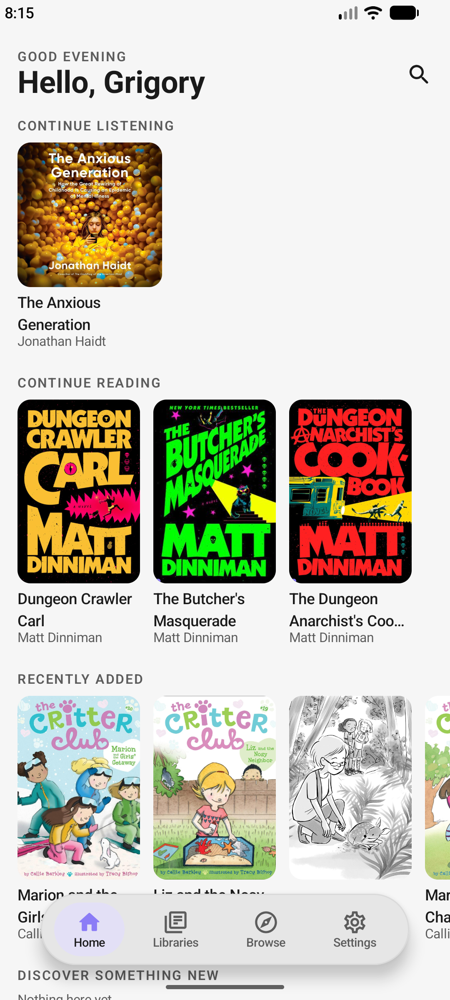<br>Home</td>
<td>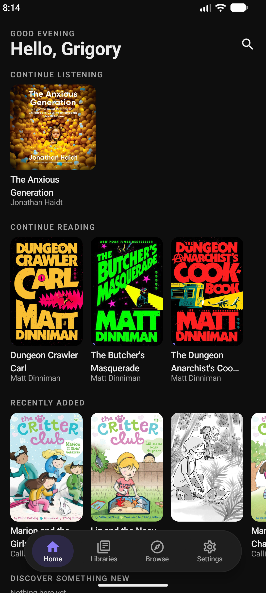<br>Home (dark)</td>
</tr>
<tr>
<td>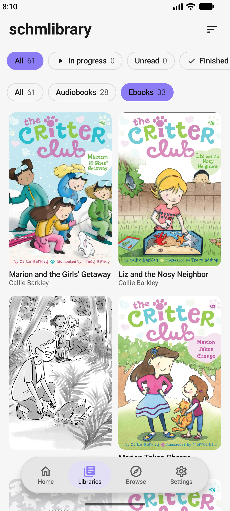<br>Libraries</td>
<td>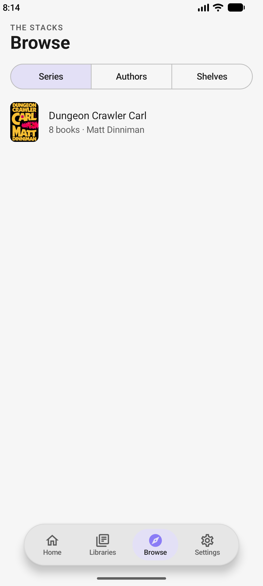<br>Browse</td>
</tr>
<tr>
<td>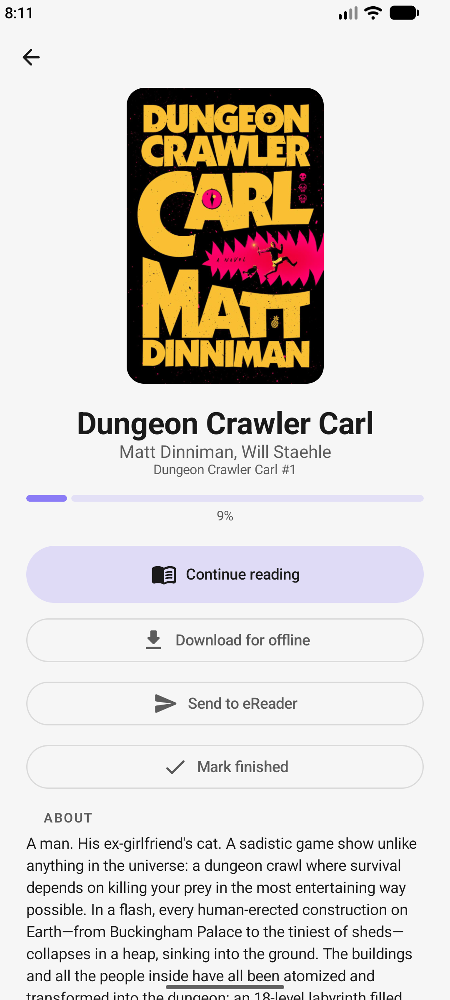<br>Book detail (ebook)</td>
<td>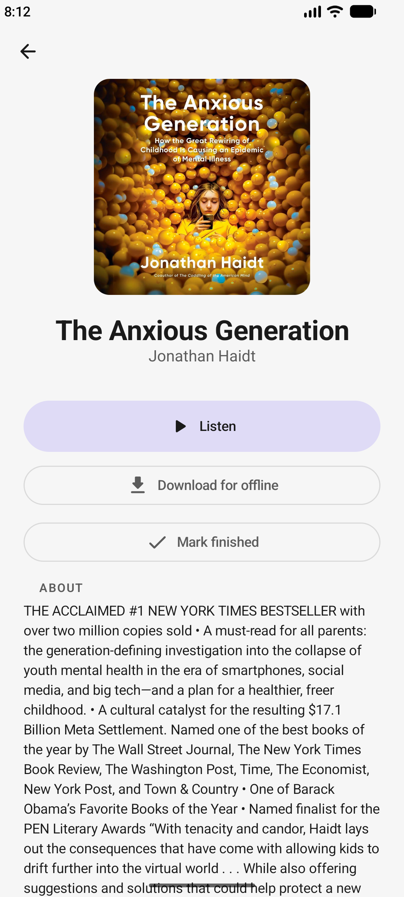<br>Book detail (audiobook)</td>
</tr>
<tr>
<td>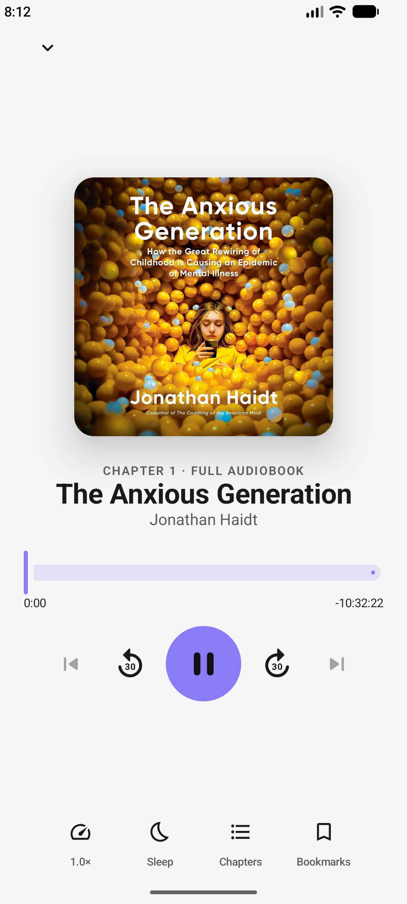<br>Now Playing</td>
<td>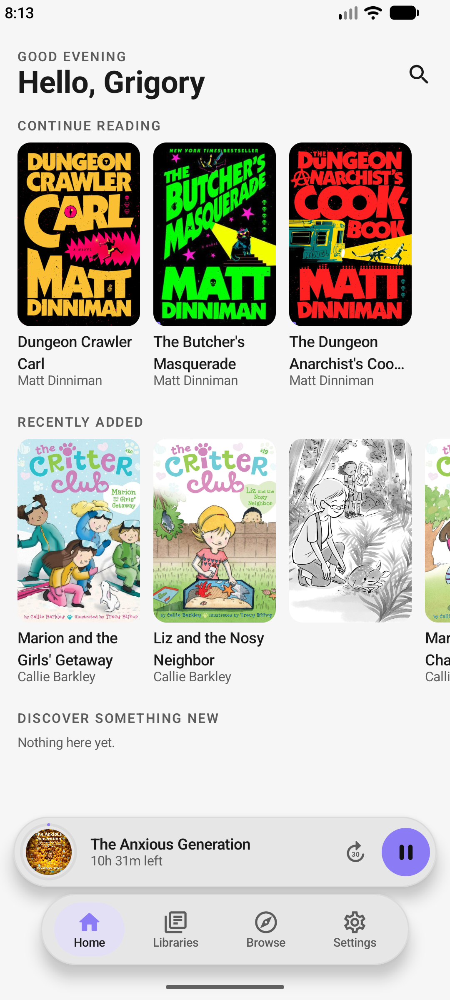<br>Mini player</td>
</tr>
<tr>
<td>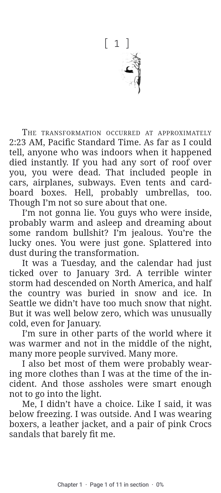<br>EPUB reader</td>
<td>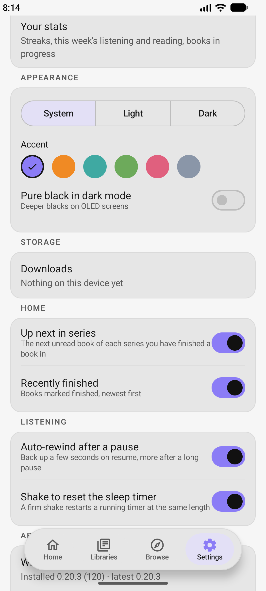<br>Settings</td>
</tr>
<tr>
<td>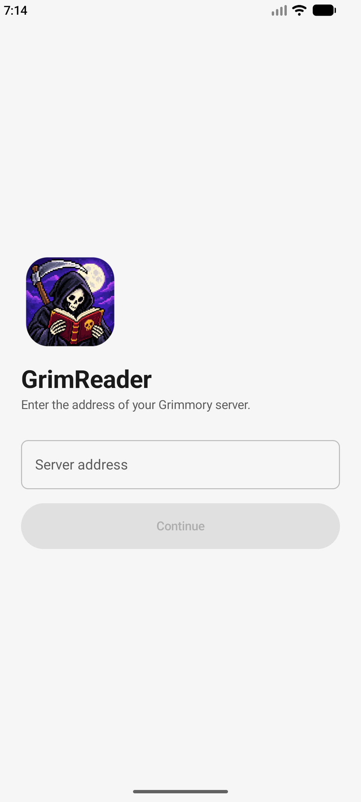<br>Sign in</td>
<td></td>
</tr>
</table>

## Coming next

Nothing on a public roadmap right now; [open an
issue](https://github.com/schmitzkr/grimreader/issues) for anything
missing or broken.

## Building

Needs JDK 21 and an Android SDK with platform 36.

```
./gradlew :core:test :app:testDebugUnitTest   # unit tests
./gradlew :app:assembleDebug                  # debug APK
./gradlew :app:assembleRelease                # release (debug-signed without the keystore env vars)
```

`core` is a plain Kotlin module (models, the Grimmory client, timeline
maths) with no Android in it; `app` is the Compose app.

Releases come from the Release workflow (`workflow_dispatch` with a version),
which stamps that version into the build, signs with the keystore in the
repository secrets, tags `vX.Y.Z` and publishes the APK on GitHub Releases.
The version of record is the tag; `app/build.gradle.kts` only holds a
placeholder, so no bump commit is needed.

The launcher icon is generated from `assets/icon/` (`icon.png` for the
README and stores, `icon_foreground.png` and `icon_monochrome.png` for the
adaptive icon layers in `app/src/main/res`).

## Licence

GNU General Public License v3.0 only (GPL-3.0-only), see
[LICENSE](LICENSE).

This applies to versions released from here forward. Earlier versions
were released under the MIT License; that grant isn't retracted and
those versions remain available under MIT.
